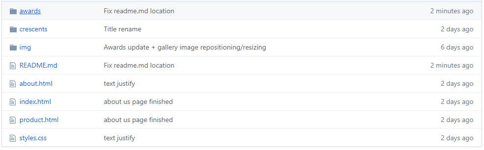
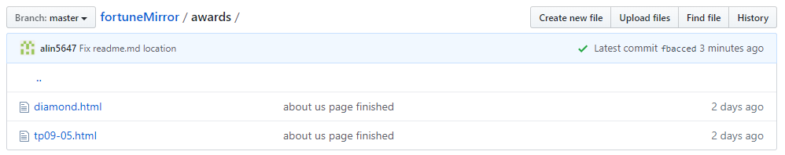
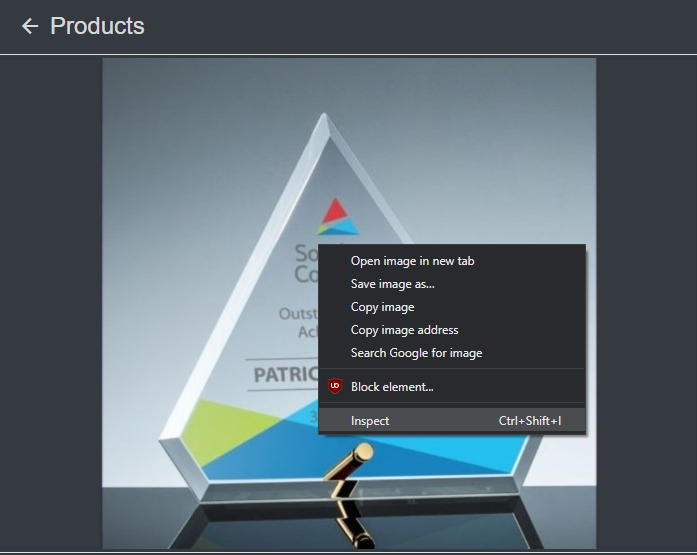
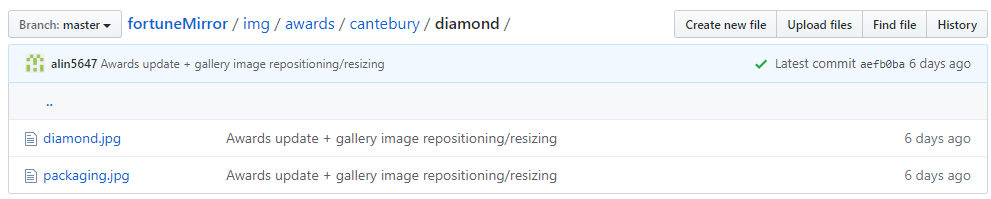

<p align="center">
  <a href="https://alin5647.github.com/fmaward/index.html">
    
  </a>
</p>

<h2 align="center">Fortune Mirror | Development</h2>

# Table of contents

General Information
- [Naming + File Organization](#naming--file-organization) (must read)
- [Changing images](#changing-images)

First Layer - index.html
- [Adding category](#adding-category)

Second Layer - product.html
- [Adding main product page](#adding-main-product-page)
- [Adding subcategory product page](#adding-subcategory-product-page)
- [Adding products to page](#adding-products-to-page)

Third Layer - product-name.html
- [Changing initial expanded image](#changing-initial-expanded-image)
- [Adding/removing pictures to/from gallery](#add/removing-pictures-to/form-gallery)
- [Editing product title/description](#edit-product-title/description)
- [Editing tables](#edit-tables)


# Naming + File Organization

## File Structure

When opening up the github repository (the main page of github) you will notice there are folders for each main category (awards/crescents/etc...).



The img folder is dedicated to images only. We'll get back to this.

There are also three html files:
- index.html
- product.html
- about.html

Lastly, the styles.css file is the file used to *style* the html file (font type/size, color, etc...)

This first "layer" of files is considered the **root**.

The second layer of files is the content inside each folder in the root such as the content inside the awards folder or crescents folder.

Inside each second layer folder will be a HTML file for each of the products inside that main category.



The img folder in the root is structured as such:

[Main Category Page Images] --> [Subcategory Page Images] --> [Product Page Images]

The only two exception is the homePageImgs which stores images for the images in index.html and the greenLogoTransp.png file which is the image for the company logo.

## Understanding the URL

The index.html file is the HTML code behind the home page of the website. You can click here to see it in the url: 

[https://alin5647.github.io/alin5647/fortuneMirror/**index.html**](https://alin5647.github.io/alin5647/fortuneMirror/index.html)

The same goes for about.html and product.html files and will show up in the url in the same way.

The product.html page is a long vertical website that contains ALL of the pages for each main category and each of their subcategories. It is made so the user cannot scroll, and will only see the appropriate section.

They are linked to each other via an identifier tag which shows up in the URL as: 

[https://alin5647.github.io/fortuneMirror/product.html/**#category-name**]().

Since product detail pages are not in the root, but rather inside the second layer folders, they will show up in the URL as: 

[https://alin5647.github.io/fortuneMirror/**main-category-folder/product-name.html**]()

For example, since the "Catebury Diamond" product is under the category "Awards", we can find the HTML file for it inside the awards folder (from the root). As such the URL for product's page will be:

[https://alin5647.github.io/fortuneMirror/**awards/diamond.html**](https://alin5647.github.io/fortuneMirror/awards/diamond.html)


# Changing Images

## Understanding Images in HTML

Images are included in HTML via links to the file in the github repository folder. This links are often found in these lines of code:

```html

```

## Finding HTML File

Images can only be changed within the HTML code. To change the image on a certain page, we need to find which HTML file it is located in.

To do that, we can look at the URL [(Read this to understand the URL)](#understanding-the-url). 

Now that we know which folder the URL is located in. We can go to the [github repository](https://github.com/alin5647/fortuneMirror/) and navigate to the HTML file.


## Finding Line in Code

To find which line in the HTML file you'll need to edit, the easiest way is to go to the website page, **right click** on the image you want to change, and then on the very bottom of the menu select **Inspect**. 



It'll open a window called DevTools and highlight the line of code that you'll need to change. The line of code should look:

```html

```

**Double click** on the underlined link inside `src="copy-this"`. This should highlight the link. Right click the link, and copy it. In this example, we would've copied:

`../img/awards/cantebury/diamond/diamond.jpg`


Now you have the line of code you want to change copied.

## Replacing the Image

Go back to the github page with the HTML. Click on the pencil icon, which will let you edit the HTML file. 

Click the editing window first, then press **CTRL + F**. This will open up a find dialog on top of the window. Paste (right click and press paste OR CTRL + V) the code you copied before, and press enter. This will highlight all instances where this picture is used.

*Other than the product gallery page*, all pictures should only be used once and therefore will be the code you will need to change.

<details><summary>If it is a product gallery page...</summary>

In the product gallery pages, the first image will be repeated to be initially shown on the expanded image. In the code, it'll look like this:

```html
<div class="container-fluid expandedImg-container d-flex flex-column justify-content-center px-0 border-bottom">
    <!--Same Image-->
    
</div>

<div class="container-fluid otherImg-container d-flex justify-content-center py-3 px-0">
    <div class="row px-2">
        <div class="col-2">
            <!--Same Image-->
            
        </div>
        <div class="col-2">
            
        </div>
        <div class="col-2">
            
        </div>
    </div>
</div>
```
In this case, you will want to change src of BOTH image links.
</details>


### Removing the old image

To remove the `diamond.jpg` image in this line of EXAMPLE code:

```html

```
We want to only delete:
`awards/cantebury/diamond/diamond.jpg` from the src.

We should be left with: 

```html

```

### Uploading your new image
We want to upload the new image to the correct folder in the img folder. 

If we wanted to replace an image for the Cantebury - Diamond product. We will want to upload the new image (for example: `jade.jpg`) in the folder: **img > awards > cantebury > diamond**.

Navigate to the folder on github. This example would have us navigate to [this folder](https://github.com/alin5647/fortuneMirror/tree/master/img/awards/cantebury/diamond). Then press **Upload Files**.



Find the image on your computer and make sure the name for the image you want is correct, then upload the image. In the "Commit changes" section add a comment like "New image" to the "Add files via upload" section, or leave it as is. 

Lastly, press **Commit Changes** and your picture should be uploaded.

Now, our new example image, `jade.jpg` should have the folder path: 
`/img/awards/cantebury/diamond/jade.jpg`.

### Getting path of new image
The part of link we will only want to use from `/img/awards/cantebury/diamond/jade.jpg` will be after the `/img/`, so:

`awards/cantebury/diamond/jade.jpg`

Then we can insert the [new path](#finding-path-of-new-image) to the src of the code:

Which should end up like:
```html

```

When you are done. Give the Commit changes a comment like "Changed diamond.jpg to jade.jpg" and then press **Commit changes**.

And you're done!


